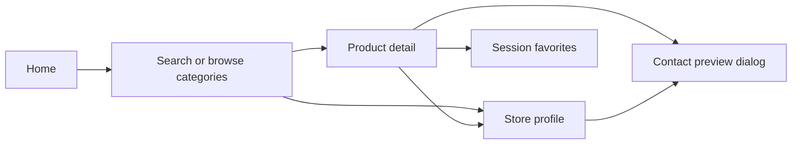

# Wally Mall

Wally Mall is a hyperlocal marketplace and commerce discovery platform initially focused on **Sorong, Papua Barat Daya**. Its product direction is to help people discover locally available products and sellers while giving local merchants, home businesses, UMKM, and local brands a structured digital storefront.

**Current stage: transactional frontend prototype.** Discovery now extends to multi-seller checkout, a mock payment gateway, order tracking, seller fulfillment, operational Admin and financial Super Admin dashboards. All accounts, payments, and data are simulated; there is no backend or real settlement. See [transaction prototype guide](docs/17-transaction-prototype.md) for demo access, architecture, authorization requirements and validation. The earlier documents describe the original discovery baseline unless superseded by this guide.

## Why Wally Mall Exists

The product is built around the hypothesis that local commerce already exists, but discovery is fragmented across Instagram, WhatsApp, Facebook, TikTok, physical stores, and word-of-mouth. A shared discovery layer could make local supply easier to find and compare. The repository contains no market research validating this hypothesis or evidence of real merchant adoption.

## Initial Market

The initial business scope is Sorong. Concentrating on a defined area is intended to increase useful merchant and product density before considering additional markets. This is a strategy to validate, not a claim of market dominance. Expansion into other parts of Papua remains a possibility contingent on demand, retention, supply density, and operational capacity.

## Product Principles

- Local-first discovery and geographic relevance.
- Seller visibility through clear storefronts and product information.
- Searchability using language buyers actually use.
- Simple merchant onboarding and manageable listing upkeep.
- Evidence-led iteration before transaction infrastructure or geographic expansion.

## Current Product

Visitors can browse 15 sample products from 5 sample sellers across 11 category definitions, search products and stores, filter and sort products, open detail pages, save session-only favorites, and copy a product link. Seller onboarding and product forms feed a session-only dashboard preview. Contact buttons display explanatory dialogs; they do not open WhatsApp or send messages.

## User Types

The prototype provides buyer, seller, admin and super_admin demo roles, guarded routes, role-specific data projections and mutation checks. On `/login`, use **Prototype Access** or **View Super Admin Prototype**. These client checks demonstrate the access matrix; production requires backend authentication and authorization.

## Core User Journey



See [current user flows](docs/04-user-flows.md) for seller simulations and their limitations.

## System Architecture

A browser runs a React single-page application. React Router selects pages; JavaScript fixture modules provide the catalog. React state holds preview changes. Product images load from Unsplash. There is no application API, authentication service, database, or upload service. The [architecture](docs/06-system-architecture.md), [proposed schema](docs/07-database-design.md), and [proposed API](docs/09-api-design.md) distinguish current behavior from future implementation.

## Tech Stack

Derived from `client/package.json`, its lockfile, imports, and Vite configuration. Versions below are locked versions at the documentation audit, not new dependency recommendations.

| Layer | Technology |
| --- | --- |
| UI | React / React DOM 19.3.0, JavaScript JSX |
| Routing | React Router 7.18.4, BrowserRouter |
| Build | Vite 6.4.3, React Vite plugin 4.7.0 |
| Styling | Tailwind CSS / Vite integration 4.3.3, DaisyUI 5.7.42, custom CSS |
| Data and state | Static JS fixtures, React hooks and outlet context |
| Backend / database | Not implemented |

## Repository Structure

```text
Wally_Mall/
  docs/                    Product, business, engineering, and audit documentation
  client/
    src/components/        Shared UI, product, seller, category, search components
    src/data/              Sample products, sellers, categories
    src/layouts/           Shared navigation and session-only preview state
    src/pages/             Discovery, detail, auth and seller preview screens
    src/routes/            Actual route configuration
    src/utils/             IDR price formatting
    src/assets/            Asset notes; wordmark is implemented in JSX
    src/styles.css         Theme, layout and responsive styling
    package.json           The only package and runnable scripts
  .env.example             Documents that no variables are currently required
  CONTRIBUTING.md          Local workflow and review expectations
```

## Getting Started

Use Node.js and npm; the audit environment uses Node 22.14.0 and npm 10.9.2. No runtime version is pinned in this project. From the Wally Mall directory:

```sh
cd client
npm ci
npm run dev
```

Open the URL printed by Vite. Development binds to `127.0.0.1`. No environment file is necessary; see [.env.example](.env.example). Use invented form values while trying the prototype.

```sh
npm run build
npm run preview
```

These commands run from `client/`. Build output is `client/dist/`. Preview is a local build check. There are **no backend, migration, seed, test, or lint scripts**. Sample data is imported automatically, not seeded into a database. See [deployment](docs/14-deployment.md) for SPA fallback requirements and the audit's verification scope.

## Documentation

Start with the [product overview](docs/00-product-overview.md), [business context](docs/01-business-context.md), or [audit report](docs/audit-report.md).

| Product and business | Engineering and operations |
| --- | --- |
| [02 Requirements](docs/02-product-requirements.md) | [06 System architecture](docs/06-system-architecture.md) |
| [03 Proto-personas](docs/03-user-personas.md) | [07 Proposed database](docs/07-database-design.md) |
| [04 User flows](docs/04-user-flows.md) | [08 Search and discovery](docs/08-search-and-discovery.md) |
| [05 Information architecture](docs/05-information-architecture.md) | [09 Proposed API](docs/09-api-design.md) |
| [11 Business rules](docs/11-business-rules.md) | [10 Authentication and authorization](docs/10-authentication-and-authorization.md) |
| [12 Analytics and KPIs](docs/12-analytics-and-kpis.md) | [13 Security and privacy](docs/13-security-and-privacy.md) |
| [15 Roadmap](docs/15-roadmap.md) | [14 Deployment](docs/14-deployment.md) |
| [Contributing](CONTRIBUTING.md) | [16 Technical decisions](docs/16-technical-decisions.md) |

## Product Status

| Status | Scope |
| --- | --- |
| **Current** | Sample-catalog discovery, detail/store pages, temporary favorites, simulated onboarding/dashboard/product forms |
| **Planned — proposed next scope** | Persistent catalog, real identity and ownership checks, seller publishing, an agreed contact channel, measurement |
| **Future — exploratory** | Monetization, transaction capabilities, behavioral/semantic ranking, geographic expansion evaluation |

Planned items in these documents are recommendations, not committed delivery dates or existing capabilities.

## Project Direction

Wally Mall is being developed as both a real business/product experiment and a production-oriented software platform. Software is the operating product through which local discovery, merchant participation, and marketplace usefulness can be tested. Production readiness remains work ahead; the current prototype demonstrates the experience and the proposed architecture documents the next boundaries to build.
