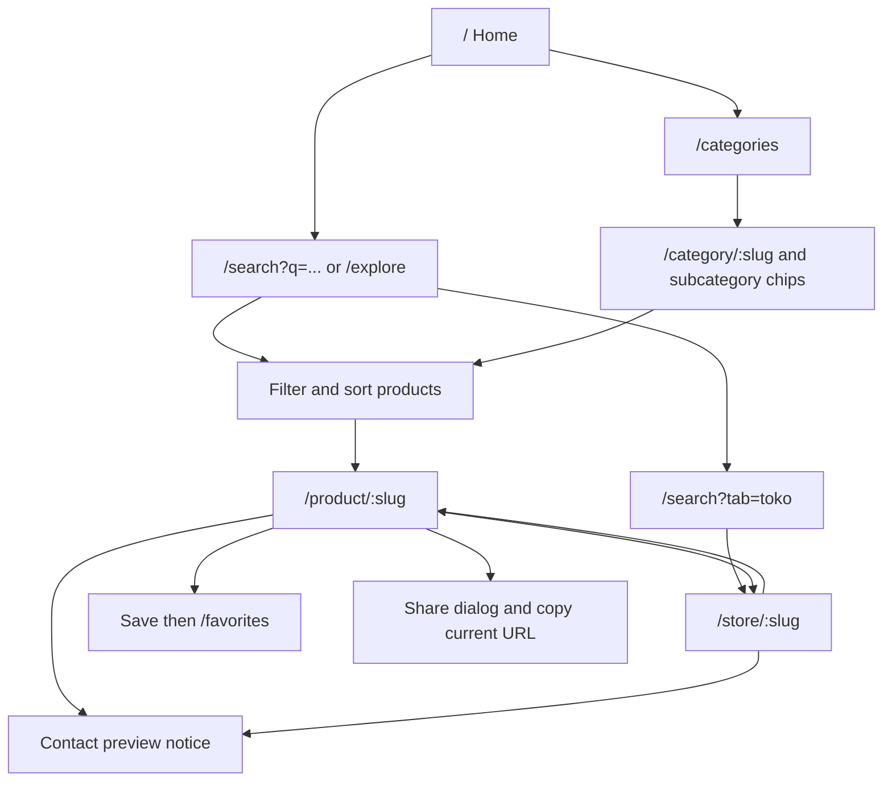
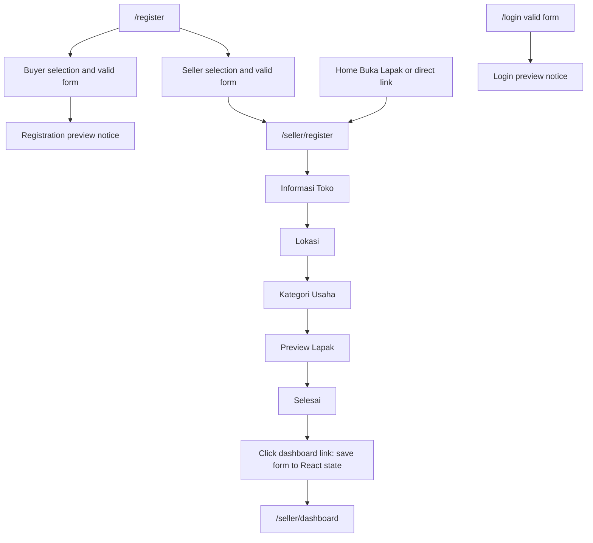
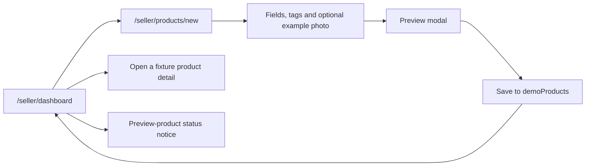

# Current user flows

[Route inventory](05-information-architecture.md) · [Requirements](02-product-requirements.md)

These flows reconstruct [AppRoutes](../client/src/routes/AppRoutes.jsx) and page handlers. All routes are public. A node marked preview is a simulation, not a backend operation.

## Buyer discovery

**Entry point:** Home, search, explore, category, or a direct detail link. **Main steps:** search/browse, optionally filter/sort, inspect product/store, save/share or click contact. **Exit state:** viewed sample information, changed session favorites, copied URL, or read a contact notice. **Known limitations:** no seller communication, purchase, order, location distance, or persistent favorites. Missing product/store/category slugs show empty states; unmatched routes show a fallback screen. Store About is an in-page tab, not a separate route.

## Registration and seller onboarding

**Entry point:** `/register`, `/login`, or directly `/seller/register` from Buka Lapak. **Main steps:** seller registration navigates to onboarding; five steps gather store name/description, area/landmark, and business category, then preview and completion. **Exit state:** the completion dashboard link sets `demoStore`; no account/store is created. **Known limitations:** authentication is not a prerequisite; registration credentials are not carried into onboarding; taking the Home link instead does not save `demoStore`. Reload resets the preview.

## Product management preview

**Entry point:** dashboard or a direct add-product link. **Main steps:** complete product fields, optionally choose a supplied photo and tags, preview, save to dashboard. **Exit state:** a session-only item is prepended to Ruang Sole's example product list. **Known limitations:** no edit/delete, upload, permanent ID, public detail page, public publication, order receipt, or cross-session persistence. Store profile is a notice; the “view example storefront” link always opens `/store/ruang-sole` even after another store name is entered.

## Admin and transaction flows

Neither exists. No diagram invents admin authentication, moderation, category management, marketplace monitoring, checkout, or order fulfillment. Future operating requirements are recorded in the [roadmap](15-roadmap.md).
