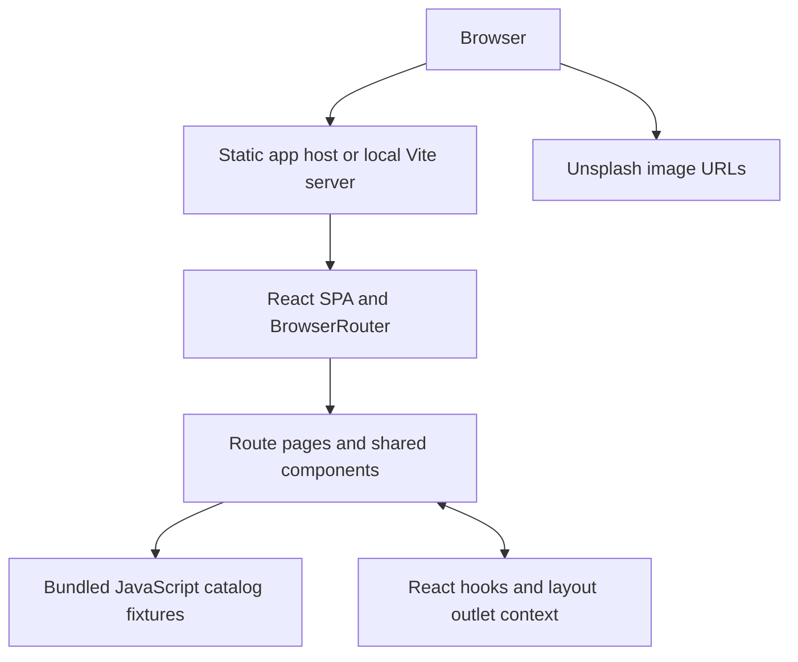

# System architecture

[Routes](05-information-architecture.md) · [Database proposal](07-database-design.md) · [Deployment](14-deployment.md)

## Current architecture

The static host is an architectural requirement, not an identified production provider. There is no API, service/repository layer, authentication server, database, object storage, or analytics integration in the implementation.

## Request and data flow

The browser requests the HTML and built assets, mounts `main.jsx` → `App.jsx` → `AppRoutes.jsx`, and renders pages inside `MarketplaceLayout`. Pages import catalog arrays directly. Search computes results synchronously in the browser; detail pages find fixtures by slug. Images are fetched directly by the browser from `images.unsplash.com`. Client navigation uses BrowserRouter; direct deep links require host fallback to `index.html`.

## State management and storage

| State | Owner | Lifetime |
| --- | --- | --- |
| Favorites (initially two sample slugs) | MarketplaceLayout | Layout lifetime; reload resets |
| `demoStore`, `demoProducts`, notice | MarketplaceLayout via outlet context | In-memory only; notice clears on navigation |
| Forms, modal state, filters, sort, selected tab/photo | Respective page/component | Component lifetime |
| Search text and result tab | URL `q` and `tab` | URL survives copying/reload |
| Product/seller/category catalog | JS modules | Bundled read-only fixtures |

There is no localStorage, sessionStorage, IndexedDB, server session, state library, or persistent upload. Dashboard preview products are a separate collection from public fixtures and have no slug or seller association. They cannot be passed into public cards unchanged, which expect valid seller/category references.

## Configuration and environment

[package.json](../client/package.json) defines `dev`, `build`, and `preview` only. [vite.config.js](../client/vite.config.js) loads React and Tailwind plugins; no proxy or custom API origin is configured. Styling imports Tailwind and configures DaisyUI plus custom CSS tokens. The document language is Indonesian and prices use `Intl.NumberFormat` for IDR.

No application environment variable reads were found in source/configuration. [.env.example](../.env.example) is intentionally comments-only. CSS `env(safe-area-inset-bottom)` is unrelated to process environment configuration. Future private service configuration belongs on a backend, not in a frontend bundle.

## Error handling and logging

Unknown routes and unknown fixture slugs show `EmptyState`. Clipboard failures show a notice. `ProductImage` hides failed images and reveals a following fallback where supplied; some direct Home images lack that handler. HTML form constraints provide basic interactive validation. No global error boundary, structured logging, error reporting service, network retry policy, or observability pipeline is present. Several fixture joins assume a valid seller/category and could throw if those relationships are broken.

## Proposed next boundary

After product decisions, introduce a server-owned catalog and identity boundary with ownership-checked writes and a relational database. Keep the frontend as a client of explicit [API contracts](09-api-design.md). Framework, hosting, auth provider, and storage provider are unresolved; no selection is implied by this diagram. Search evolution is specified separately in [Search and discovery](08-search-and-discovery.md).
