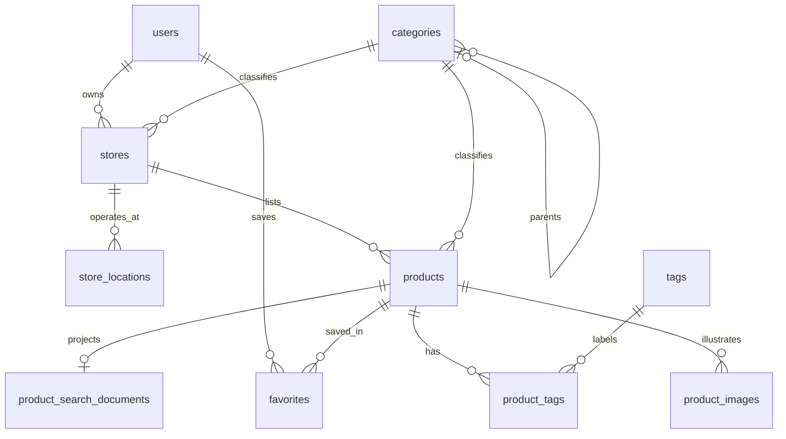

# Database design

[Architecture](06-system-architecture.md) · [Search](08-search-and-discovery.md) · [API proposal](09-api-design.md)

## Status and current data

**Proposed schema based on the current product flow.** No database models, migrations, ORM, server, or seed runner exist. This document does not create tables or modify a database. PostgreSQL is a proposed persistence choice; its version and hosting remain unselected.

Current data comes from [products.js](../client/src/data/products.js), [sellers.js](../client/src/data/sellers.js), and [categories.js](../client/src/data/categories.js). Slugs act as identity and relationship keys. Products carry one category, a subcategory string, tags, optional image/rating, price, condition, stock, and description. Sellers combine storefront name, area, description, decorative initials, sample rating/badge, and a formatted joined date. Categories contain subcategory arrays. Neither fixture data nor preview state is a production schema.

## Design conventions — proposed

Use UUID primary keys for new persistent entities, retaining unique stable slugs for public URLs. There is no existing database ID convention to preserve. UUID generation strategy is a backend implementation decision. Store timestamps as `timestamptz`; mutable entities have `created_at` and `updated_at`, with the latter maintained on every write. Pure join tables need only `created_at`. Required fields below are NOT NULL unless marked optional. All relationship IDs are foreign keys.

Separate the account (identity), store (public business), and product (offering). A user may own multiple stores in the proposed schema; the UI currently demonstrates one. Restricting the first release to one store per seller is an open policy choice. No separate seller profile is needed until business identity has fields distinct from account and store.

## Proposed table dictionary

### users

`id uuid PK`; `name varchar(100)`; `email text optional`; `phone text optional`; `password_hash text`; `role text` constrained to `buyer|seller`; `status text` constrained to `active|disabled`; timestamps.

Require at least one verified login identifier before activation. Unique normalized email (case-insensitive) and normalized phone when present. Verification timestamps `email_verified_at` and `phone_verified_at` are optional. Password hash assumes first-party password authentication; replace with an external subject model if a provider is selected. No plaintext passwords. Buyers may become sellers and sellers may still browse/save; role does not create an admin permission. Authentication and recovery architecture must be confirmed before migration.

### stores

`id uuid PK`; `owner_user_id uuid FK users`; `name varchar(60)`; `slug text UNIQUE`; `description varchar(500)`; `primary_category_id uuid FK categories`; `logo_url text optional`; `banner_url text optional`; `phone text optional`; `whatsapp_number text optional`; `status text` constrained to `draft|active|inactive`; timestamps.

Name, description and primary category map to onboarding. Contact fields are conditional on the selected contact channel, not evidence of current WhatsApp integration. Slugs remain stable on name changes unless redirects are designed. An active store needs an approved public contact method and a primary location under the proposed publication policy. Initials can be derived; fixture ratings and badges must not be imported as real reputation.

### store_locations

`id uuid PK`; `store_id uuid FK stores`; `public_area text`; `address text optional`; `district text`; `city text`; `province text`; `postal_code text optional`; `latitude numeric(9,6) optional`; `longitude numeric(9,6) optional`; `is_primary boolean`; timestamps.

`public_area` holds a seller-approved landmark/area for discovery. Detailed address and coordinates should be optional and private by default; public responses use an allowlist. Coordinates must both be present or absent, with latitude -90..90 and longitude -180..180. A partial unique index on `store_id WHERE is_primary` ensures at most one primary location; the publication transaction ensures at least one. The initial UI needs only one location, but separating it avoids duplicating geography into every listing and permits later branches without asserting current multi-region operations. Pilot coverage validation belongs in configurable service policy, not a CHECK forcing all future rows to Sorong.

### categories

`id uuid PK`; `parent_id uuid optional FK categories`; `name text`; `slug text UNIQUE`; `description text optional`; `status text` constrained to `active|inactive`; `sort_order integer`; timestamps.

Represent the existing category/subcategory structure as parent/child rows. Reject self-parenting and cycles (the latter needs service/trigger validation). Make subcategory slugs globally unique using parent context, since labels such as Aksesoris recur. Products reference one leaf category; the top-level category is derived through its parent. No `product_categories` join is needed for the current single-choice UI.

### products

`id uuid PK`; `store_id uuid FK stores`; `category_id uuid FK categories`; `name varchar(100)`; `slug text UNIQUE`; `description text`; `price numeric(12,0)`; `currency char(3)` with initial policy `IDR`; `condition text` constrained to `new|used`; `status text` constrained to `draft|active|inactive`; `stock_quantity integer`; `published_at timestamptz optional`; timestamps.

Proposal: price 1..9,999,999,999 rupiah, matching the form's range; integer stock 0..99,999, extending the form's minimum 1 so sold-out listings can be represented. These must become server validations, not just browser attributes. Derive `stock_status` from quantity instead of storing contradictory state. For Jasa, the UI calls stock “slots”; this is indicative capacity, not a booking ledger. Confirm whether unknown quantity and service scheduling warrant separate concepts before implementing them. Product-level location in the form currently affects only preview text; the proposal uses the store's primary location, requiring a UI/policy decision before rollout.

### product_images

`id uuid PK`; `product_id uuid FK products`; `image_url text`; `sort_order integer >= 0`; `is_primary boolean`; timestamps. Unique `(product_id, sort_order)` and partial unique `(product_id) WHERE is_primary` prevent duplicate ordering/primary selection. A publication rule can require one primary image if product policy chooses; the current form makes photos optional. This table supports a real gallery, unlike the current duplicated illustration. It is not an upload implementation.

### tags and product_tags

`tags`: `id uuid PK`, `name varchar(35)`, `normalized_name text UNIQUE`, timestamps. Preserve display text separately from normalized identity.

`product_tags`: `product_id uuid FK products`, `tag_id uuid FK tags`, composite PK `(product_id, tag_id)`, `created_at`. Enforce at most ten tags per product transactionally, following the current form; a row CHECK alone cannot enforce a count across rows. Tags supplement structured categories and do not grant priority by repetition.

### favorites

`user_id uuid FK users`; `product_id uuid FK products`; composite PK `(user_id, product_id)`; `created_at`. This is a proposed persistent account feature. Guest favorites can remain a temporary client feature; merging them at login requires a deliberate deduplicating flow. Do not migrate preselected demo favorites into real accounts.

### product_search_documents — derived, rebuildable V1 data

`product_id uuid PK/FK products`; `normalized_name text`; `search_text text`; `search_vector tsvector`; `normalization_version integer`; `updated_at timestamptz`.

This is a deliberate search projection, not a replacement for normalized catalog tables. It combines product name, category ancestry, tags, store name and description according to the [search design](08-search-and-discovery.md). Update it within catalog write transactions initially; changing a tag/category/store name must refresh all affected products. Rebuild when normalization changes. Search still joins authoritative visibility/region state so a stale projection cannot expose an inactive store.

### search_aliases — V2 only

`id uuid PK`; `canonical_term text`; `alias text`; `language text`; `scope_key text` (non-null global or agreed regional vocabulary identifier); `status text` constrained to `active|inactive`; timestamps. Normalize both terms. Unique `(language, scope_key, alias, canonical_term)` avoids duplicate edges while permitting reviewed ambiguity. Prefer direct alias-to-canonical mappings rather than recursive expansion. This later table is justified by buyer/seller vocabulary differences, not required for current fixture matching.

Illustrative documentation rows only; do not seed as unreviewed production vocabulary:

| canonical_term | alias | language | scope_key |
| --- | --- | --- | --- |
| handphone | hp | id | global |
| handphone | smartphone | id | global |
| handphone | ponsel | id | global |

## ERD — proposed

`search_aliases` is an independent vocabulary resource used during V2 query expansion, without a product FK. ERD optional relationships allow drafts; publication imposes stronger completeness requirements.

## Index and integrity plan

| Index/constraint | Purpose |
| --- | --- |
| Entity PKs and unique store/product/category slugs | Referential identity and direct route lookup; uniqueness already supplies indexes |
| Unique normalized account identifiers | Avoid ambiguous login identity |
| `stores(owner_user_id)` | Retrieve and authorize a seller's stores |
| `products(store_id, status)` | Dashboard/store inventory and publication filtering; supports store_id-prefix lookups |
| `products(category_id, status)` | Public category retrieval |
| `products(status, published_at, id)` | Stable recent-listing pagination; evaluate selectivity before retaining |
| `categories(parent_id, sort_order)` | Subcategory navigation |
| `store_locations(city, district, store_id)` | Initial area filtering; use controlled canonical values |
| Primary-location/image partial uniqueness | Prevent contradictory presentation defaults |
| `product_tags(tag_id, product_id)` | Reverse tag lookup; product-first PK supports product retrieval |
| `favorites(product_id)` | Product cleanup/aggregate access; user-first PK serves saved lists |
| GIN on `product_search_documents.search_vector` | Full-text candidate retrieval |
| GIN trigram on `normalized_name` | Bounded partial/typo candidate retrieval, evaluated against real queries |
| V2 alias unique key plus canonical-term lookup | Expansion and vocabulary maintenance |

Do not add redundant single-column slug/store indexes when a unique or composite prefix already serves them. A standalone low-selectivity status index is not automatically useful; validate query plans with representative data. Foreign keys do not replace ownership checks.

Use restrictive deletes for users owning stores, stores owning products, and referenced categories. Cascade dependent images, tag joins, favorites and search projections when a product is explicitly deleted. Draft/active/inactive is a publication lifecycle, not blanket soft deletion. Define account deletion, record retention and audit needs before adding `deleted_at` everywhere. Store publication changes, tags, image ordering and search projections should be transactional.

## Entities evaluated but deferred

No seller_profiles (duplicative today), product_variants (no variant selector), product_categories (one category choice), product_search_terms (tags and aliases cover the proposed need), reviews (ratings are examples), orders/payments (no transaction flow), or admin_actions (no admin system). `product_views`, `search_events`, and `contact_events` are deferred as separate transactional tables; first agree the [event contract and privacy policy](12-analytics-and-kpis.md), then select an analytics store. A session table or external identity linkage depends on the auth decision.

## Migration planning, not execution

Select backend/migration tooling; agree identifier and auth policy; create core tables and constraints in development; map fixture slugs to IDs only for clearly labeled demo seeds; add search projection/rebuild capability; test visibility and ownership; test backup restoration. No production seed, migration command, or database change is included in this documentation task.
