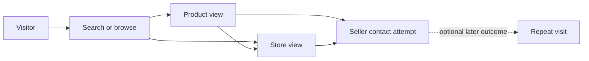

# Analytics and KPIs

[Business context](01-business-context.md) · [Search](08-search-and-discovery.md) · [Security/privacy](13-security-and-privacy.md)

## Metrics currently tracked

**None as real business telemetry.** There is no event SDK, analytics API, event database or operational dashboard. Seller-dashboard views (248), favorites (32), and contacts (12) are constants; product count is the fixture-plus-preview array length. Popular searches, recent-search examples, ratings and badges are not evidence of behavior. Do not report them as traction.

## Candidate North Stars — not selected

Active searchable products measures useful supply only if quality and freshness are controlled. Active sellers measures participation but can conceal shallow catalogs. Buyer-to-seller contact attempts is closer to value but does not prove a successful conversation. Choose an official North Star after testing which outcome represents recurring buyer and seller benefit; no official choice or numerical target exists.

## Recommended discovery funnel

Store view is optional before contact. Repeat visit is a cohort outcome, not a guaranteed next step. If a future channel hands off to WhatsApp, completed sales remain unobserved without consented seller feedback or a future transaction system; the current button does not even perform that handoff.

## Proposed event contract

Common fields: unique `event_id`, event/schema version, timestamp, anonymous short-lived session identifier, route, source surface and fixture/test exclusion flag. Optional resource IDs must reference valid catalog objects. A random `search_id` links a search impression to subsequent actions without relying on raw query text. No passwords, raw phone numbers, full addresses, or precise coordinates in events.

| Event | Trigger | Additional minimum properties | Caveat |
| --- | --- | --- | --- |
| `search_performed` | Committed query result rendered, not each keystroke | `search_id, result_count, type, filters, latency_ms`; redacted query only if policy permits | Deduplicate rerenders and retries |
| `category_opened` | Category result screen presented | `category_id, result_count` | Distinguish empty supply from query failure |
| `product_viewed` | Product detail presented | `product_id, store_id, search_id?` | Repeated render is not a new visit |
| `store_viewed` | Store profile presented | `store_id, search_id?` | Not necessarily required before contact |
| `seller_contact_clicked` | User initiates real configured contact handoff | `store_id, product_id?, channel, search_id?` | Exclude preview notices; not message delivery |
| `product_saved` | Product transitions from unsaved to saved | `product_id, persistence_type` | No event for initial fixture favorites |

Seller publication/update events and account/store activation records should be authoritative server facts once persistence exists. Page impression events alone do not prove publication. Instrumentation is recommended, not present.

## Recommended metric definitions

Use a documented reporting window and common timezone (proposed reporting in Asia/Jakarta; store timestamps in UTC). Initial weekly/monthly views are reporting suggestions, not established targets. Exclude staff/test/fixture activity and define bot/retry filtering before baselining.

| Area | Metric | Definition |
| --- | --- | --- |
| Seller acquisition | Registered sellers | Distinct verified accounts that elected seller capability, as of period end |
| Activation | Activated sellers | Registered sellers with an active store, usable contact channel and at least one searchable product |
| Activation | Seller activation rate | Cohort sellers activated within an agreed window / eligible registered sellers in that cohort; avoid mixing lifetimes |
| Supply | Active stores / products | Records meeting the shared public eligibility rule at snapshot time; do not count drafts |
| Supply | Active listings per seller | Eligible products / activated sellers, accompanied by median/distribution |
| Supply | Category coverage | Count/share of agreed priority category-area pairs with useful supply; agree “useful” before thresholds |
| Search | Search volume | Distinct deduplicated committed searches in window |
| Search | Zero-result rate | Searches returning zero eligible results / valid committed searches; report failed requests separately |
| Search | Click-through after search | Searches with at least one attributable result click / eligible result-bearing searches |
| Search | Top search terms | Frequency of normalized, privacy-reviewed terms; suppress low-count sensitive terms |
| Search | Search-to-contact conversion | Searches with an attributed real contact attempt / valid searches in the same agreed attribution window |
| Demand | Contact attempts | Deduplicated user-initiated handoffs, reported with distinct store/product coverage |
| Retention | Returning visitors | Consistently identifiable consented visitors returning in a later window / eligible earlier cohort |
| Seller retention | Listing activity | Activated sellers creating/updating listings in window; distinguish metadata spam from availability upkeep |

Decide attribution window before collection (for example, same-session attribution as a proposed starting point). Avoid adding product and store contact counts for the same action. Browser privacy choices and device changes mean visitor retention will be an estimate, not an exact headcount.

## Measurement rollout

First instrument a real contact channel and committed discovery events; establish supply-quality and seller-activation baselines; review zero-result terms with merchants; then evaluate retention and acquisition cost. Observe buyer tasks and merchant feedback alongside event counts. A growing catalog with stale listings is not success.

Select an analytics storage/provider only after agreeing access, retention, deletion, query redaction and consent requirements. Raw search strings may include personal information. Keep analytics separate from essential catalog transactions so measurement outages do not block discovery. No dedicated view/search/contact tables are prescribed prematurely.
